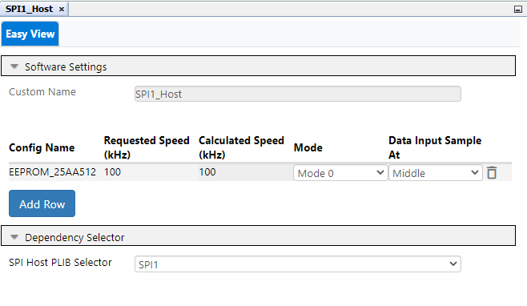

 

## dsPIC33CK Curiosity SPI Demo

## Summary

This project demonstrates SPI Communication on dsPIC33CK Curiosity board using MCC-Melody driver code.
The demo code writes string and Numbers into EEPROM and reads it back from eeprom then compares 
trasmitted and received string and Numbers to validate EEPROM write read. 
This example uses 25AA512 based SPI PIM with size of 512K bit with 128byte page size.

## Related Documentation

[dsPIC33CK256MP508 datasheet](https://www.microchip.com/dsPIC33CK256MP508) for more information or specifications

## Software Used

- [MPLAB® X IDE v6.00](https://www.microchip.com/mplabx) or newer
- [MPLAB® XC16 v2.00](https://www.microchip.com/xc16) or newer
- Device Family Pack : dsPIC33CK-MP_DFP v1.8.224
- [MPLAB® Code Configurator (MCC) 5.1.17](https://www.microchip.com/mcc) or newer
- Tera Term or any serial terminal

## Hardware Used

- [dsPIC33CK Curiosity Board](https://www.microchip.com/dm330030)
- [SPI PIM]

## Setup

**Hardware Setup**

- Connect a micro-USB cable to port `J7` of Curiosity board to USB port of PC
- Make connection using connecting wires between SPI PIM and Curiosity board.

**MPLAB® X IDE Setup**

- Open the `dspic33c-dma-adc-to-uart.X` project in MPLAB® X IDE
- Build and program the device

**Data Visualizer (DV) Setup**

1. In DV plugin select the communication port for curiosity board, click on terminal view and select display values in hex format (As 12-bit ADC is being configured, the conversion output will be in the range 0 to 4095). Refer the below image for DV Setup

## Operation

- The demo code has two states - string write/read and Number write/read.
- In first state demo code writes string (declared in transmit buffer) into EEPROM and reads it back from EEPROM in receive buffer,
  Compares both transmit and receive buffer and prints the EEPROM write/read status in Serial Terminal.
- In second state demo code writes Number starting from 0 to 127(Max page size) into EEPROM and reads it back from EEPROM,
  Compares transmitted and received Numbers and prints the EEPROM write/read status in Serial Terminal.

## MCC settings for reference

**SPI-Host Configuration**

- SPI Host Configuration done in MCC Melody User Interface for this demo code 
  

**UART Configuration**

- UART Configuration done in MCC Melody User Interface for this demo code  
  

**PIN Configuration**

- SPI pins: RD6 for SDO1, RD7 for SDI1, RD8 for SCK1 and RE10 for CS(chip select)
- UART Pins: RD4 as U1TX and RD3 as U1RX 
  