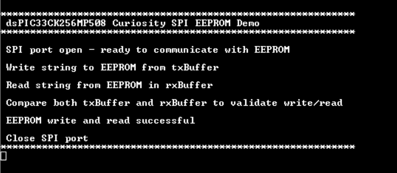

 

## dsPIC33CK Curiosity SPI Demo

## Summary

This project demonstrates SPI communication on the dsPIC33CK Curiosity board using MCC-Melody driver code.
The demo code writes strings and numbers into EEPROM and reads them back from EEPROM, then compares 
transmitted and received strings and numbers to validate EEPROM write and read. 
This example uses 25AA512 based SPI PIM with a size of 512K bits with 128-byte page size.

## Related Documentation

[dsPIC33CK256MP508 datasheet](https://www.microchip.com/dsPIC33CK256MP508) for more information or specifications

## Software Used

- [MPLAB® X IDE v6.00](https://www.microchip.com/mplabx) or newer
- [MPLAB® XC16 v2.00](https://www.microchip.com/xc16) or newer
- Device Family Pack : dsPIC33CK-MP_DFP v1.8.224
- [MPLAB® Code Configurator (MCC) 5.1.17](https://www.microchip.com/mcc) or newer
- Tera Term or any serial terminal

## Hardware Used

- [dsPIC33CK Curiosity Board](https://www.microchip.com/dm330030)
- [SPI PIM](https://www.microchip.com/en-us/development-tool/ac243003)

## Setup

**Hardware Setup**

- Connect a micro-USB cable to port `J7` of Curiosity board to the USB port of a PC.
- Make a connection using connecting wires between SPI PIM and the Curiosity board.

**MPLAB® X IDE Setup**

- Open the `dspic33c-dma-adc-to-uart.X` project in MPLAB® X IDE.
- Build and program the device.

## Operation

- The demo code has two states - strings write/read and number write/read.
- In the first state, the demo code write a string (declared in transmit buffer) into the EEPROM and reads it back from the EEPROM in the receive buffer,
  compares both the transmit and receive buffer, and prints the EEPROM write/read status in the serial terminal.
- In second state demo code writes number starting from 0 to 127(Max page size) into EEPROM and reads it back from EEPROM,
  compares transmitted and received numbers and prints the EEPROM write/read status in serial terminal.
  

## MCC settings for reference

**SPI-Host Configuration**

- SPI Host Configuration done in MCC Melody User Interface for this demo code 
  

**UART Configuration**

- UART Configuration done in MCC Melody User Interface for this demo code  
  

**PIN Configuration**

- SPI pins: RD6 for SDO1, RD7 for SDI1, RD8 for SCK1 and RE10 for CS(chip select)
- UART Pins: RD4 as U1TX and RD3 as U1RX 
  